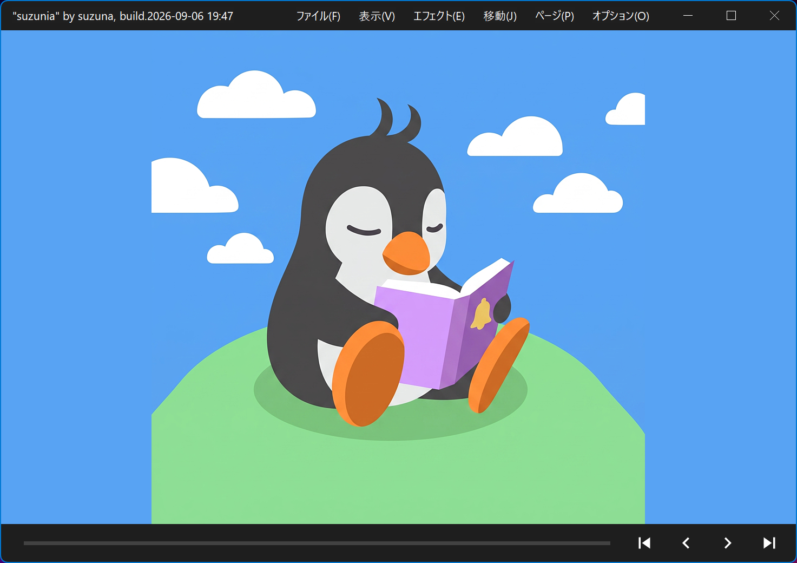

# suzunia

Windows 用の漫画・画像ビューアです。
**起動やページ送りなど全体の速度**を最優先に設計しています。

## 更新履歴

アップデートは、古いアプリが存在するフォルダに新しいzipの内容を全て上書きコピーすればOKです。

### 2026.08.12.(未来から来ました)

- エフェクト「自動レベル調整」を追加しました。
- エフェクト「疑似カラー化」を追加しました。
- 「2ページ表示時にサイズ調整」機能を追加しました。

### 2026.08.11.

- アップスケーリング機能を追加しました。軽量な代わりに低品質です。
- ICCプロファイルに対応しました。動作確認がまともにできていません。
- エフェクト周りをまとめ、プリセットとして管理出来るようにしました。

### 2026.08.10.

- 「余白の自動カット」機能を追加しました。
- 「横長ページの分割表示」機能を追加しました。
- 90度ずつの回転に対応しました。
- ランダムなページ/書籍への移動を追加しました。
- 圧縮ファイルの削除に対応しました。
- タイトルバー描画を微調整しました。
- 関連付け設定の不具合を修正しました。

### 2026.08.09.

- epubフォーマットに対応しました。
- 設定アプリ上にシェル統合(右クリックメニュー、関連付け)タブを追加しました。

### 2026.08.08.

- しおり（ブックマーク）機能を追加しました。
- 自動ページ送り（スライドショー）機能を追加しました。2パターンの速度を指定できます。
- マウスジェスチャー操作に対応しました。
- 書庫内書庫に対応しました。
- 先読み状況を視覚化しました。タイトルバー左上のページ数に"＊"が付いている間は先読みロードが走っています。
- ファイルの削除（ゴミ箱行き/直接削除）機能を追加しました。
- ファイルの再読み込み機能を追加しました。

## 動作環境

| 項目 | 要件 |
|---|---|
| OS | Windows 10 / 11 (**64bit専用**)。ARM 版 Windows は対象外 |
| CPU | AVX2 対応の x64 CPU (Intel 第4世代 Core〈2013年〉以降、AMD Ryzen シリーズなど) |
| 本体 `suzunia.exe` | 追加ランタイム**不要** (必要な DLL はすべて同梱) |
| 設定画面 `suzunia-settings.exe` | [.NET デスクトップ ランタイム 10.0 (x64)](https://dotnet.microsoft.com/ja-jp/download/dotnet/10.0) が必要 |

- 本体は NativeAOT でビルドした自己完結型の実行ファイルで、.NET のインストールは不要です。
- .NET ランタイムが無い環境でも閲覧機能はすべて動きます。開けないのは設定画面だけです (設定は `suzunia.json` の直接編集でも変更できます)。

## インストールと起動

1. [Releases](../../releases) から zip をダウンロードします。
2. 好きな場所に展開します。
3. `suzunia.exe` を実行します。

zip には本体 (`suzunia.exe`)、設定画面 (`suzunia-settings.exe` ほか)、画像・書庫デコーダの DLL、同梱ライブラリのライセンス文書 (`license/`) が入っています。

### SmartScreen の警告が出たら

実行ファイルにコード署名をしていないため、初回起動時に Windows SmartScreen が「Windows によって PC が保護されました」という警告を出すことがあります。**「詳細情報」→「実行」の順にクリックして、気にせずそのまま実行してください。**

### レジストリや他のフォルダを汚しません

- インストーラはありません。suzunia がレジストリへ書き込むことはなく、設定・履歴などのファイルはすべて **exe と同じフォルダ**に作られます。
- **アンインストールはフォルダごと削除するだけ**で完了します。
- 例外: `C:\Program Files` 内など書き込みできない場所に展開した場合に限り、設定ファイルは `%APPDATA%\suzunia` に保存されます。ポータブルに使いたい場合は書き込み可能な場所に置いてください。

### 通信は一切行いません

**suzunia にネットワーク機能はありません。** 更新チェック・テレメトリ・クラッシュレポートなどを含め、ネット上へ情報を送信することは一切ありません。

### 開き方

どの方法でも開けます。

- `suzunia.exe` を起動して、ウインドウへ書庫・フォルダ・画像を**ドラッグ＆ドロップ** (タイトルバーのメニューから「開く」でも可)
- 書庫や画像を `suzunia.exe` のアイコンへドロップ
- エクスプローラの「プログラムから開く」で `suzunia.exe` を指定 (関連付ければダブルクリックで開けます)
- コマンドライン: `suzunia.exe <ファイルまたはフォルダのパス>`

## 特徴

### すべての動作が速度重視

- Win32 API 直書き + NativeAOT。GUI フレームワーク (WPF / WinForms) を使いません。
- 起動時に実行するのは「書庫を開く → 1ページ目をデコード → 縮小 → 表示」の一本道だけで、それ以外 (ウインドウ生成・設定読み込み・先読みの準備) はすべて並行して走らせます。
- 前後のページは先読みしてキャッシュするため、ページ送りは数 ms で完了します。
- 静止画を表示している間の CPU 使用率は 0% です (常駐タイマーやレンダーループを持ちません)。

### zip (cbz) が最速です

- zip は自前のリーダで読みます (メモリマップ + 中央ディレクトリ解析。無圧縮エントリはコピーせずそのままデコーダへ渡します)。**速さを求めるなら書庫は無圧縮 (store) の zip / cbz を推奨します。**
- rar / 7z にも対応していますが、solid 書庫は形式の性質上、先頭からの逐次展開になるため zip ほどの速度は出ません。
- **壊れた zip の救済**: 終端レコードや中央ディレクトリが壊れた zip でも、ローカルヘッダを走査して読める分をすべて読みます。データが途中で切れたページも、展開できたところまで表示します。
- zip 内の日本語ファイル名 (CP932 / Shift_JIS) も文字化けしません。

### 対応フォーマット

**静止画** — 拡張子ではなくファイルの中身で形式を判定するので、拡張子が実態と食い違っていても表示できます。

| 形式 | 備考 |
|---|---|
| JPEG (.jpg .jpeg .jpe .jfi .jfif) | |
| PNG (.png .apng) | APNG は先頭フレームのみ表示 |
| GIF (.gif) | |
| WebP (.webp) | |
| AVIF (.avif) | |
| JPEG XL (.jxl) | |
| TIFF (.tif .tiff) | |
| BMP (.bmp .dib) | |
| ICO (.ico) | |
| HEIC / HEIF (.heic .heif) | OS のコーデックがある場合のみ |
| その他 | OS (WIC) に追加コーデックが入っていれば、それも読めます |

**アニメーション画像** — GIF / WebP / AVIF / JPEG XL の4形式に対応。透過 (アルファ) は背景と合成して表示します。

**書庫など**

| 形式 | 備考 |
|---|---|
| zip / cbz | 最速。壊れた zip の救済つき |
| rar / cbr | rar5・solid 対応 |
| 7z / cb7 | solid 対応 |
| PDF | 設定した DPI でラスタライズして表示 |
| epub | ページ数把握の為に最初に開く際は時間が掛かります |
| フォルダ | フォルダを1冊の本として表示。サブフォルダを含めるかは設定で選択 |
| 画像ファイルの直接指定 | 指定した1枚を即表示し、同じフォルダの画像を1冊として扱います |

### 設定画面は別アプリです

本体に設定 GUI を同居させると、GUI フレームワークのロードだけで起動が約10倍遅くなります (実測: 空ウインドウの表示まで Win32 は 24〜29ms、WPF は 266〜324ms)。動作を最速化するため、設定画面 `suzunia-settings.exe` は別プロセスにしてあります。設定画面での変更は、起動中の本体へ即時反映されます。

### 機能は絞ってあります

一晩で作られたアプリのため、機能は「漫画・画像を読む」ことに必要なものだけに絞っています。本棚・サムネイル一覧・タグ管理・画像編集のような機能はありません。

### ファイル名で本ごとの表示を指定できます

ファイル名 (またはフォルダ名) に次のタグを含めておくと、その本を開いたときだけ表示設定が上書きされます。

| タグ | 効果 |
|---|---|
| `[左開き]` | 左開き (1ページ目が左) で表示 |
| `[単ページ]` | 1ページ表示にする |
| `[1ページ目単独]` | 2ページ表示でも最初のページを単独表示 (表紙用) |
| `[最終ページ単独]` | 2ページ表示でも最後のページを単独表示 (裏表紙・奥付用) |

例: `作品名 第1巻 [左開き][1ページ目単独].zip`

書いていない項目は通常の設定どおり表示されます。開いた後にメニューで変更した場合はそちらが優先されます。

## 機能一覧 (概要)

詳しい操作リファレンスは別途用意します。ここでは何ができるかの一覧だけ。

- **ページ移動** — 次/前、画面の左/右 (開き方向で自動解決)、1ページ単位、見開き単位、設定 A / B ページ単位のジャンプ、最初/最後、ページ番号を指定して移動、見開きの組み合わせを1ページずらす
- **書籍移動** — 同じフォルダ内の前後の本へ移動。本の端に達したときの動作は「そのまま / ループ / 次の本へ」から選択
- **表示モード** — 1ページ / 2ページ (見開き) 表示、右開き / 左開き、横長ページの自動単独表示、最初・最後のページの単独表示
- **表示サイズ** — 7種 (オリジナルサイズ / ウインドウに合わせる / 大きい画像だけ縮小 / 小さい画像だけ拡大 / ウインドウを埋める / 高さに合わせる / 幅に合わせる)。よく使う2つを設定 A / B として1操作で切り替え可能
- **画質** — 補間法 7種 (最近傍 / 面積平均 / 線形 / Catmull-Rom / Mitchell / スプライン / Lanczos3)、アンシャープマスク、低解像度画像だけ最近傍で表示 (ドット絵用)
- **パンとズーム** — 左ドラッグで表示位置をスライド、カーソル位置を起点にした設定倍率へのズーム
- **背景** — 単色 / 画像の色に合わせる / 市松模様 (透過画像用)
- **ページの並び順** — ファイル名 / 日付 / サイズ / 書庫エントリ順 (それぞれ昇順・降順)、ランダム
- **ウインドウ** — 全画面表示、常に手前に表示、自前描画のタイトルバー (OS のライト / ダークテーマとアクセントカラーに追従)、ページスライダー (タイトルバー下端の現在位置表示。クリック / ドラッグで移動)
- **情報パネル** — 別ウインドウに本 / ページ / 画像 / 表示 / EXIF の情報を表示
- **ページのコピーと保存** — コピーは原寸のビットマップ (見開きは1枚に連結)、保存は元データをそのまま書き出すので無劣化
- **履歴** — 最大 50 件。「最近使ったファイル」から前回読んでいたページの続きを開けます
- **操作のカスタマイズ** — 60 以上のコマンドをキーとマウス (クリック / ダブルクリック / 長押し / ホイール / 押しながらホイール / X ボタン) に自由に割り当て
- **効果音** — ページ・本の移動が端で止まったときに .wav を再生 (既定はオフ)
- **その他** — ドラッグ＆ドロップ、多重起動の抑止 (設定で許可も可)、ウインドウ位置と全画面状態の復元、エクスプローラで開く、設定ファイルの再読み込み

## 設定ファイル

すべて exe と同じフォルダに JSON で保存されます。手動で編集しても構いません (「設定の再読み込み」コマンドか再起動で反映)。

| ファイル | 内容 |
|---|---|
| `suzunia.json` | 表示・動作の設定、キー / マウスの割り当て |
| `suzunia-history.json` | 閲覧履歴 (最大 50 件) |
| `suzunia-window.json` | 本体ウインドウの位置と状態 |
| `suzunia-settings-window.json` | 設定画面ウインドウの位置 |

## ライセンス

- **suzunia 本体はフリーウェアです。** 無償で利用できます。著作権は作者が保有するみたいですがAIに全部作らせたのに著作権あんの不思議やね？
- 配布 zip をそのままの形で共有するのは自由ですが公式の配布ページはここだけです。改変しての再配布、実行ファイルの解析 (逆コンパイル・逆アセンブル) はやりたければ好きにすればいいんじゃない？責任はとらないけど。一晩で作ったって言ってるでしょ？
- 同梱している第三者ライブラリには、それぞれのライセンスが適用されます。全文は zip 内の `license/` フォルダにあります。

| 同梱 DLL | ライブラリ | ライセンス |
|---|---|---|
| jxl.dll | libjxl (brotli, highway ほかを含む) | BSD-3-Clause ほか |
| libwebp.dll / libwebpdemux.dll / libsharpyuv.dll | libwebp | BSD-3-Clause |
| avif.dll | libavif | BSD-2-Clause |
| dav1d.dll | dav1d | BSD-2-Clause |
| pdfium.dll | PDFium (freetype, libjpeg-turbo ほかを含む) | BSD-3-Clause / Apache-2.0 ほか |
| 7z.dll | 7-Zip | LGPL-2.1 (unRAR 制限つき) |
| vcruntime140.dll | Visual C++ ランタイム | Microsoft の再頒布ライセンス |

7z.dll は改変せず、そのまま動的ロードで使用しています (LGPL の条件に基づき、ライセンス全文を `license/` に同梱しています)。

## 免責事項

- 本ソフトウェアは「現状のまま (AS IS)」提供され、動作・品質・特定目的への適合性について、明示・黙示を問わずいかなる保証もありません。
- 本ソフトウェアの使用または使用不能により生じたいかなる損害 (データの損失を含む) についても、作者は一切の責任を負いません。
- 自己責任でご利用ください。

## バグ報告・要望

[Issues](../../issues) へどうぞ。ソース非公開のため Pull Request は受け付けていません。

バグ報告には次の情報があると助かります。

- 症状と再現手順
- 開いていたファイルの種類 (zip / rar / 7z / PDF / フォルダ) と、分かれば中の画像形式・サイズ
- OS のバージョン

## 謝辞

機能と操作の体系は過去の類似ビューワ、特にMangaMeeyaを参考にしています。
MangaMeeya後継として利用する予定です。自分は。

アイコンのオリジナルは、飲み会の費用の肩代わりとして[yosshinさん](https://yosshin4004.github.io/)に作ってもらいました。

